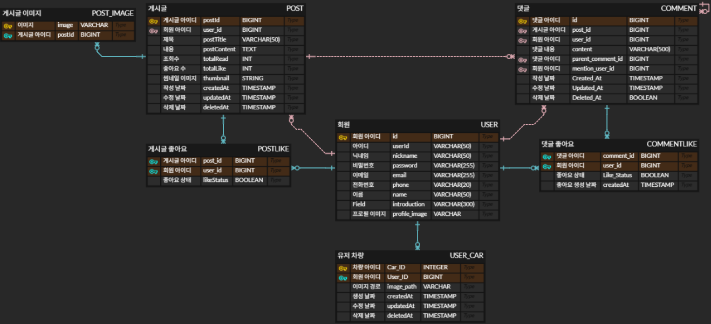
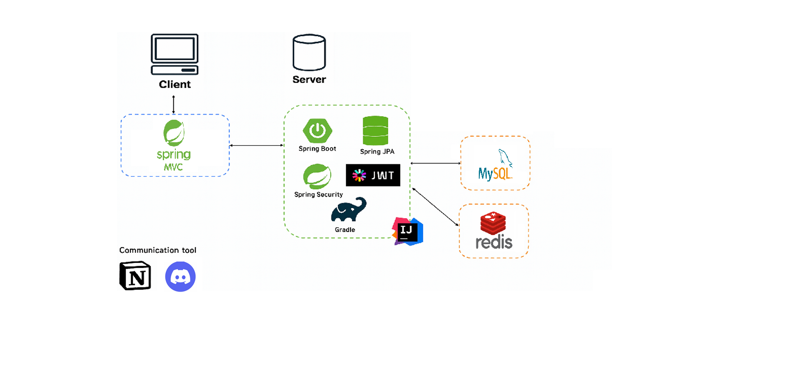

# CarsCommunity  
### 자동차 커뮤니티 사이트 (현재 리팩토링중)

---

## 1. 프로젝트 개요

### 프로젝트명  
** CarsCommunity— 자동차 커뮤니티 & 튜닝 이미지 관리 플랫폼

### 프로젝트 기간  
2025년 11월 ~ 2025년 ing

### 프로젝트 목표
- 차량 관련 정보를 공유하고 소통할 수 있는 커뮤니티 제공
- 자동차 튜닝 이미지(2D/3D) 저장 및 관리 기능 제공 
- 사용자 간 댓글, 좋아요 등 상호작용 기능 제공  
- 파일 업로드·조회·관리 가능한 안정적인 백엔드 제공  

### 주요 타겟 사용자
- 자동차 튜닝을 좋아하는 일반 사용자  
- 자신의 차량 커스터마이징 이미지를 저장하고 싶은 사용자
- 차량 정보/팁/노하우를 공유하고 싶은 커뮤니티 유저 

---

## 2. 프로젝트 소개

### 프로젝트 배경 및 문제 정의

| 분류 | 항목 | 상세 내용 |
| :--- | :--- | :--- |
| **배경** | 유저 니즈 | 자동차 튜닝 유저들은 **2D/3D 이미지, 차량 데이터, 파츠 정보**를 체계적으로 저장하고 공유할 수 있는 환경을 필요로 합니다. |
| **문제** | 정보 파편화 | 튜닝 정보, 파츠 데이터, 갤러리 이미지 등이 여러 곳에 흩어져 있어 **체계적인 관리 및 검색이 어렵습니다.** |
| **문제** | 시뮬레이션 관리 부재 | 3D 튜닝 시뮬레이션 결과물 **(GLB/GLTF 파일)**을 저장하거나 유저 간에 공유할 수 있는 플랫폼이 없습니다. |
| **문제** | 비표준화된 스펙 공유 | 튜닝 스펙 공유가 수동 입력이나 이미지에 의존하여 **정확성과 재사용성**이 낮습니다. |
| **문제** | 통합 소통 환경 부족 | Q&A, 자랑, 추천 등 튜닝 관련 소통을 **하나의 플랫폼에서 통합**하기 어렵습니다. |

### 기존 서비스의 한계 및 CarsCommunity의 차별화

| 분류 | 항목 | 기존 서비스의 한계 |
| :--- | :--- | :--- |
| **한계** | 단순 갤러리 기능 | 기존 커뮤니티는 단순히 사진만 업로드하여 **3D 파일이나 상세 스펙 관리**는 불가능합니다. |
| **한계** | 튜닝 시뮬레이터와 분리 | 튜닝 시뮬레이터 결과물을 **커뮤니티 활동과 연계**하여 저장/공유하는 기능이 부족합니다. |
| **한계** | 파츠 정보 매핑 불가 | 이미지나 글에서 사용된 파츠 정보를 **자동으로 식별하거나 검색**할 수 있는 기능이 부재합니다. |
| **한계** | 데이터 비활용 | 공유된 튜닝 데이터가 **분석이나 추천에 재활용되지 못하고** 게시글로만 소비됩니다. |

### CarsCommunity의 핵심 목표 및 개발 방향

| 분류 | 목표 | 상세 개발 방향 |
| :--- | :--- | :--- |
| **핵심 목표** | 3D 튜닝 결과물 저장/공유 | 시뮬레이션한 **튜닝 차량의 3D 모델(GLB)**을 개인 슬롯에 저장하고 게시글에 첨부하여 공유할 수 있도록 구현 |
| **핵심 목표** | 통합 스펙 관리 | 튜닝 파츠 코드 목록을 게시글에 자동 연결하고, 이를 기반으로 **파츠 쇼핑 장바구니 및 구매 연계** 기능을 제공|
| **지원 환경** | 풍부한 미디어 지원 | **2D 이미지, 3D 모델 파일, 상세 튜닝 스펙 데이터** 등 다양한 형태의 미디어를 지원하는 게시판/갤러리 환경을 구축합 |
| **활용 목표** | 정보 검색 및 교류 활성화 | 체계적으로 저장된 튜닝 데이터를 기반으로 유저들이 **특정 파츠나 튜닝 스타일**을 쉽게 검색하고 소통할 수 있도록 지원 |

## 3. 기능 명세서 

<a href="https://www.notion.so/2c185bcdbd2680f58980e90c0c2721e8" 
   style="display:inline-block;padding:10px 20px;background:#007bff;color:white;border-radius:8px;text-decoration:none;font-weight:bold;">
    기능 명세서 보러가기
</a>

---

## 4. API 명세서

<a href="https://www.notion.so/API-2c185bcdbd2680c4b520ef4126d6852e" 
   style="display:inline-block;padding:10px 20px;background:#007bff;color:white;border-radius:8px;text-decoration:none;font-weight:bold;">
   API 명세서 보러가기
</a>

---

## 5. DB 명세서 

---

## 6. 시스템 아키텍처 

---

## 7. 팀원 소개

| 이름 | 파트 | 담당 |
|------|------|------|
| **김현수** | Backend | Post, Email, User, File , TestCode(단위 테스트)|
| **조현우** | Backend | Car , Comment, Exception |

---

## 8. 기술 스택

| 영역                    | 기술                                                                                                                 |
| --------------------- | ------------------------------------------------------------------------------------------------------------------ |
| **Backend**           | Java 21, Spring Boot 3.4, Spring MVC, Spring Security, JWT, JPA, Validation, QueryDSL                              |
| **Database**          | MySQL 8, Redis(Set 기반 좋아요 관리 / 캐싱)                                                                                 |
| **Development Tools** | IntelliJ IDEA, Postman, Git & GitHub , Jenkins , Mook , JUnit                                                       |

---

## 9. 문서 자료
[문서 보기](./assets/F_F%20제품%20소개서.pdf)

---

🚗 CarsCommunity
“자동차 유저들이 서로 소통하고 튜닝을 즐기는 공간을 만듭니다.”

